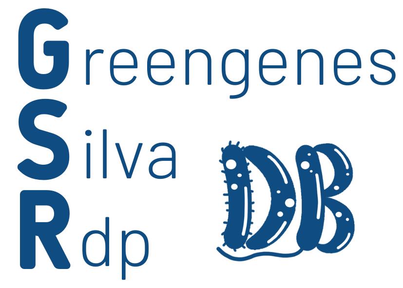

# GSR: a manually curated and optimised taxonomical database for 16S rRNA amplicon analysis
<p align="center">

</p>

## What is the GSR database?

GSR database (Greengenes, SILVA, and RDP database) is an integrated and manually curated database for bacterial and archaeal 16S amplicon taxonomy analysis. Unlike previous integration approaches, this database creation pipeline includes a taxonomy unification step to ensure consistency in taxonomical annotations. The database was validated with three mock communities and two real datasets and compared with existing 16S databases such as Greengenes, GTDB, ITGDB, SILVA, RDP, and MetaSquare. Results showed that the GSR database enhances taxonomical annotations of 16S sequences, outperforming current 16S databases at the species level. The GSR database is available for full-length 16S sequences and the most commonly used hypervariable regions: V4, V1-V3, V3-V4, and V3-V5. It can be downloaded at https://manichanh.vhir.org/gsrdb/. 

## Usage guidelines

### Recommended usage
1. Download the GSR database of the region of interest from [here](https://manichanh.vhir.org/gsrdb/).
2. Train a QIIME2 naive-bayes classifier with the database files and the default parameters.
3. Use the trained classifier to get the taxonomy profile of the ASVs, setting the confidence parameter to 'disable'. 

We recommend following the QIIME2 preprocessing pipeline to process your reads and obtain the ASVs (Amplicon Sequence Variants). Look at this [QIIME2 tutorial](https://docs.qiime2.org/2023.2/tutorials/moving-pictures-usage/) for further guidelines on the preprocessing step and the feature classification step. You can also find a simple example below:  

### Usage example

In this example we will obtain the taxonomy profile of our 16S V4 amplicon reads.

1. Install QIIME2
```
wget https://data.qiime2.org/distro/core/qiime2-2023.2-py38-linux-conda.yml
conda env create -n qiime2-2023.2 --file qiime2-2023.2-py38-linux-conda.yml
```

2. Download example data (obtained from [QIIME2 tutorial](https://docs.qiime2.org/2023.2/tutorials/moving-pictures-usage/))

```
wget \
  -O 'emp-single-end-sequences.zip' \
  'https://docs.qiime2.org/2021.11/data/tutorials/moving-pictures-usage/emp-single-end-sequences.zip'

unzip -d emp-single-end-sequences emp-single-end-sequences.zip

wget \
  -O 'sample-metadata.tsv' \
  'https://docs.qiime2.org/2021.11/data/tutorials/moving-pictures-usage/sample-metadata.tsv'
```

3. Read preprocessing 
	1. Import data
	```
	qiime tools import \
	  --type 'EMPSingleEndSequences' \
	  --input-path emp-single-end-sequences \
	  --output-path emp-single-end-sequences.qza
	```
	2. Demultiplex sequences
	```
	qiime demux emp-single \
	  --i-seqs emp-single-end-sequences.qza \
	  --m-barcodes-file sample-metadata.tsv \
	  --m-barcodes-column barcode-sequence \
	  --o-per-sample-sequences demux.qza \
	  --o-error-correction-details demux-details.qza
	```
	3. Denoise and obtain ASVs
	```
	qiime dada2 denoise-single \
	  --i-demultiplexed-seqs demux.qza \
	  --p-trim-left 0 \
	  --p-trunc-len 120 \
	  --o-representative-sequences rep-seqs.qza \
	  --o-table table.qza \
	  --o-denoising-stats stats.qza

	```

4. Download GSR V4 database
```
wget https://manichanh.vhir.org/gsrdb/GSR-DB_V4_cluster-1.tar.gz
tar -xvzf GSR-DB_V4_cluster-1.tar.gz
```

5. Train naive-bayes classifier with default parameters

```
qiime feature-classifier fit-classifier-naive-bayes \
  --i-reference-reads GSR-DB_V4_cluster-1_seqs.qza \
  --i-reference-taxonomy GSR-DB_V4_cluster-1_taxa.qza \
  --o-classifier GSR-DB_V4_cluster-1_classifier.qza
```
6. Get taxonomy profile, setting confidence level to 'disable'. 
```
qiime feature-classifier classify-sklearn \
  --i-classifier GSR-DB_V4_cluster-1_classifier.qza \
  --i-reads rep-seqs.qza \
  --o-classification taxonomy.qza \
  --p-confidence disable
```

## Contents of this repository

This repository contains the code and the input files for the reproducibility of our work (see `Index.ipynb`), as well as some usage guidelines exposed in this README file. 

## Citing GSR database 

If you find the GSR database helpful, please cite:

Leidy-Alejandra G. Molano, Sara Vega-Abellaneda, Chaysavanh Manichanh (2023). GSR: a manually curated and optimised taxonomical database for 16S rRNA amplicon analysis. *UNPUBLISHED YET*

## Contact information

Feel free to contact us if you have any feedback, questions or issues:

Leidy-Alejandra G. Molano: gonmola@hotmail.com  
Sara Vega-Abellaneda: saravg99@gmail.com  
Chaysavanh Manichanh: cmanicha@gmail.com

## License
<p xmlns:cc="http://creativecommons.org/ns#" xmlns:dct="http://purl.org/dc/terms/"><a property="dct:title" rel="cc:attributionURL" href="https://manichanh.vhir.org/funomic/">GSR-DB</a> by <a rel="cc:attributionURL dct:creator" property="cc:attributionName" href="https://manichanh.vhir.org/">Leidy-Alejandra G. Molano, Sara Vega-Abellaneda, Chaysavanh Manichanh</a> is licensed under <a href="http://creativecommons.org/licenses/by-nc/4.0/?ref=chooser-v1" target="_blank" rel="license noopener noreferrer" style="display:inline-block;">CC BY-NC 4.0  </a></p> 

